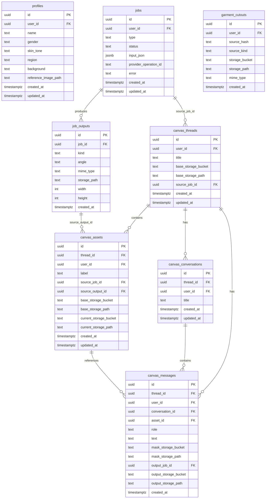

# Database (Supabase Postgres) — Schema + ERD

This app uses **Supabase Postgres** for persistence + **Supabase Storage** for binary assets (images/videos/zips).

All tables listed below have **RLS enabled** (verified via Supabase metadata).

## Core tables (summary)

- **`profiles`**: model profile configuration (gender/skin/region/background + reference image path)
- **`jobs`**: a logical generation/edit job (e.g., product pack render, try-on, canvas edit)
- **`job_outputs`**: outputs produced by a job (usually images, sometimes other kinds)
- **`canvas_threads`**: “Creation” workspace (one per generation job via `source_job_id`)
- **`canvas_assets`**: images inside a creation (one per `job_outputs` + current pointer)
- **`canvas_conversations`**: multiple chats per creation
- **`canvas_messages`**: chat messages; assistant messages can reference an output asset path
- **`garment_cutouts`**: cached garment cutouts (transparent PNG) keyed by hash + kind (front/back)

## ERD (entity-relationship diagram)

## Table details

### `profiles`
Used by **Product Pack** and other generators to maintain consistent identity/style.
- **Key columns**
  - `reference_image_path`: path in Storage bucket `profiles`
- **API**
  - `GET /api/profiles` returns a short-lived `referenceImageUrl` (signed URL)
  - `POST /api/profiles` uploads a profile image and creates the row

### `jobs` / `job_outputs`
Unified history feed and job grouping.
- `jobs.type` values used in code include:
  - `product_pack`, `tryon_image`, `canvas_edit`, `extract_garment`
- `jobs.input_json` stores prompt, angles, product metadata, etc.
- `job_outputs.storage_path` points to the object in Storage (bucket depends on kind/feature)

### `canvas_threads` / `canvas_assets` / `canvas_conversations` / `canvas_messages`
These tables implement **Magic Canvas** as a chat-based editor with **one job → one creation (thread) → multiple assets → multiple versions**.

- A **thread** is a “Creation” workspace (typically one per `jobs.id` via `source_job_id`).
- An **asset** represents one image within the creation (often mapped to a `job_outputs.id`).
  - `current_storage_*` points to the most recent version.
  - `base_storage_*` points to the original base image for that asset.
- A **conversation** is a chat session inside the creation.
- A **message** is either:
  - `role='user'` with an edit instruction, and optional mask (`mask_storage_*`), or
  - `role='assistant'` with an output image reference (`output_storage_*`) and optional `output_job_id` for history linking.

### `garment_cutouts`
Caches transparent garment cutouts to reduce stretching and improve garment placement.

Cache key:
- `user_id` + `source_hash` + `source_kind` (`front` | `back`)

Used by:
- `POST /api/generate-image` when `type=pack` and `useCutout=true`

## Storage buckets

The code uses the following **Supabase Storage buckets**:

- **`outputs`**: generated images and Magic Canvas masks/versions
- **`profiles`**: uploaded model profile reference images
- **`extractions`**: extracted garment cutouts
- **`videos`**: (planned) generated video artifacts
- **`zips`**: (planned) downloadable zipped sets

Paths are typically prefixed with `user.id/…` for tenancy.

## RLS (high-level expectations)

Policies are not checked into this repo, but the runtime assumes:

- Users can only `select/insert/update/delete` rows where `user_id = auth.uid()` for:
  - `profiles`, `jobs`, `canvas_threads`, `canvas_assets`, `canvas_conversations`, `canvas_messages`, `garment_cutouts`
- `job_outputs` should be join-protected via `jobs.user_id` (since `job_outputs` doesn’t have `user_id`).

