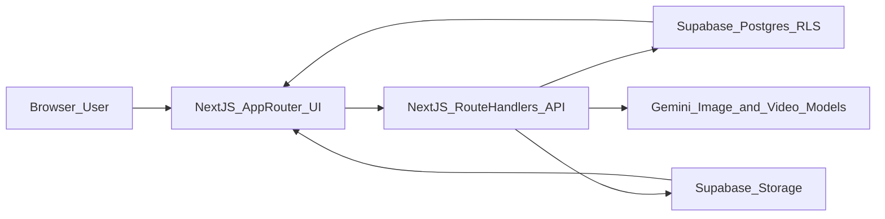
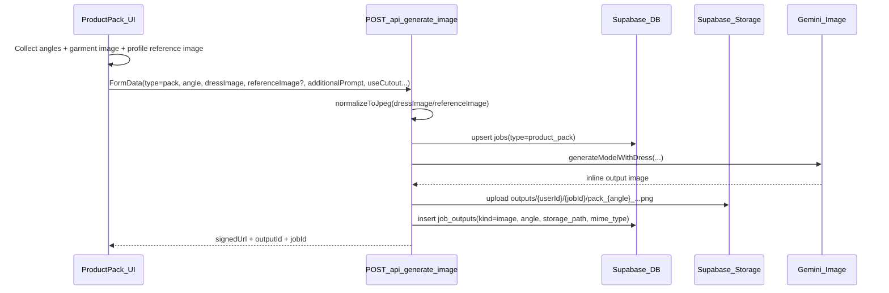
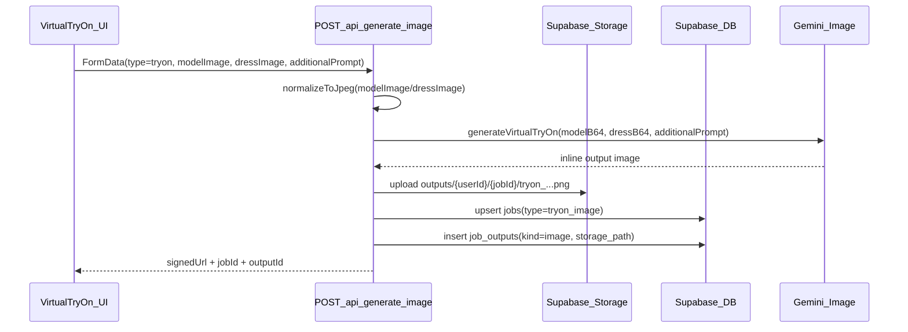
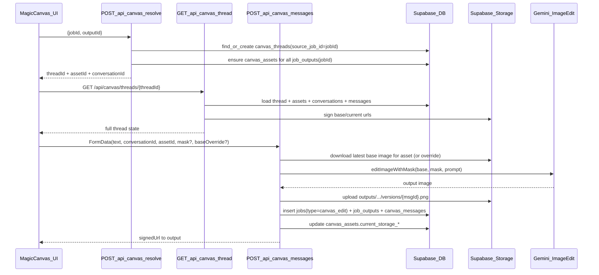
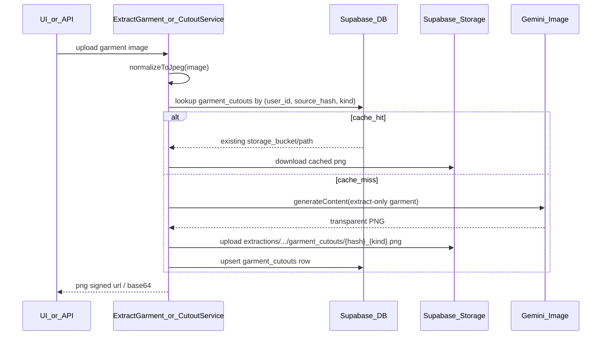

# System Design — Yuneekwayai (Virtual Try-On + Magic Canvas)

This document explains the architecture, data flows, and key implementation details for the **Yuneekwayai** application so new engineers can quickly contribute.

## Tech stack

- **Frontend**: Next.js 16 (App Router), React 19, TypeScript
- **Styling**: Tailwind CSS v4
- **State**: Zustand (client-side)
- **Backend**: Next.js Route Handlers (`src/app/api/**`)
- **Database**: Supabase Postgres (RLS enabled)
- **Auth**: Supabase Auth (cookie-based session via `@supabase/ssr`)
- **Storage**: Supabase Storage (buckets: outputs, profiles, extractions, videos, zips)
- **AI provider**: Google Gemini (`@google/genai`)
- **Image processing**: `sharp` (server-side normalization)

## High-level architecture



### Key product concepts

- **Job**: one logical generation/edit action (stored in `jobs`)
- **Job output**: an artifact created by a job (stored in `job_outputs`)
- **Creation (Magic Canvas thread)**: one shared workspace thread per job (`canvas_threads.source_job_id`)
- **Asset**: an image within a creation (`canvas_assets`), often mapped to `job_outputs`
- **Conversation**: a chat session inside a creation (`canvas_conversations`)
- **Message**: chat message; assistant messages can reference an output image (`canvas_messages`)

## Codebase structure (where to look)

```text
nextjs_app/
  src/
    app/
      api/                      # Backend route handlers (JSON/FormData)
      app/                      # Auth-protected UI pages (workspace)
      login|register|forgot/    # Auth pages
    components/                 # Feature UIs (ProductPack, MagicCanvas, TryOn, etc.)
    lib/
      gemini.ts                 # Gemini prompts + SDK usage
      image-normalize.ts        # sharp normalization to safe JPEG
      garment-cutout.ts         # cached cutout generation
      creation-title.ts         # user-friendly creation titles
      supabase/                 # auth + server/browser clients
      store.ts                  # zustand store (active profile)
    middleware.ts               # auth redirects for /app
```

## Authentication & routing

`src/middleware.ts` enforces:
- unauthenticated users visiting `/app/**` are redirected to `/login`
- authenticated users visiting `/login|/register|/forgot` are redirected to `/app`
- API routes are **not** redirected by middleware (each API route does its own `401` checks)

## Data model (overview)

See [`DATABASE.md`](DATABASE.md) for the full ERD and tables.

At a glance:
- Generation features create rows in `jobs` + `job_outputs`
- Magic Canvas uses `canvas_threads`, `canvas_assets`, `canvas_conversations`, `canvas_messages`
- Storage stores binaries (images/masks/versions), referenced by DB paths

## Primary flows

### 1) Product Pack (multi-angle model renders)

Goal: user uploads garment images and generates consistent multi-angle photos using a selected model profile.



Notes:
- **Angles** are generated per request (UI loops selected angles).
- Optional **cutout pipeline** (`useCutout=true`) creates/uses a cached transparent PNG in `garment_cutouts` to improve fit.

### 2) Virtual Try-On (dress on a model photo)



### 3) Magic Canvas (one creation → multiple versions)

Goal: **one creation per job**, show all images/versions, edit using chat, support multiple chats.



Important invariants:
- `canvas_threads.source_job_id` enforces **one creation per job** (deduped in thread listing).
- `canvas_assets.source_output_id` ties job outputs to assets inside the creation.

### 4) Garment extraction / cutout caching

Used both as a standalone tool and internally when Product Pack uses cutouts.



## Reliability & production readiness notes

### Image normalization
Gemini image endpoints can reject inputs due to:
- HEIC/HEIF formats
- huge images
- odd color profiles

Server-side normalization is handled in:
- `src/lib/image-normalize.ts` (`sharp` → sRGB JPEG, resized, size-capped)

### Signed URL expiration (profiles)
Profiles return a **signed URL** for reference images; it expires. UI should refresh/reselect profile if it becomes invalid.

### Observability (recommended improvements)
Not fully implemented yet, but production should add:
- structured logs with request IDs
- error reporting (Sentry, etc.)
- rate limiting on generation endpoints

## Environments & configuration

Required environment variables:
- `NEXT_PUBLIC_SUPABASE_URL`
- `NEXT_PUBLIC_SUPABASE_ANON_KEY`
- `GEMINI_API_KEY`

## Deployment notes (Vercel)

- Next.js is deployable on Vercel as-is.
- Configure the three env vars in Vercel project settings.
- Ensure Supabase Auth redirect URLs include your Vercel domain and your custom domain.

## Security model (current)

- All APIs use `getSupabaseAuthedClient`:
  - prefers cookie session (browser)
  - falls back to `Authorization: Bearer <token>` for scripts
- RLS is enabled on key tables and should enforce `user_id = auth.uid()` access (see `DATABASE.md`).


